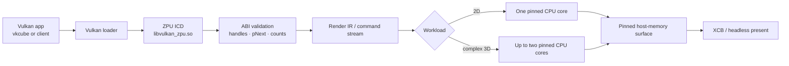
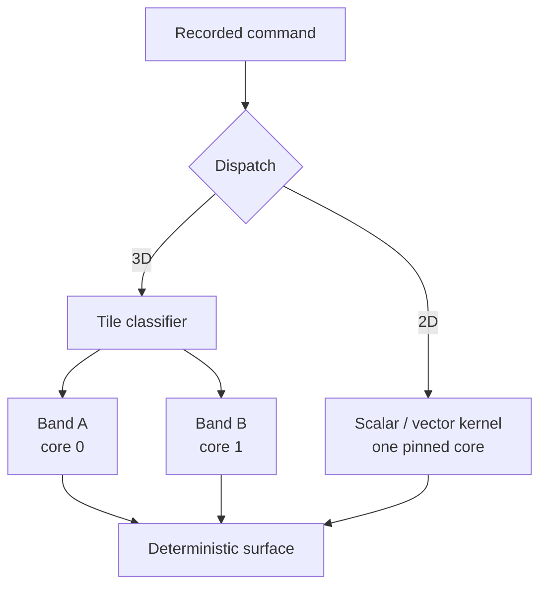
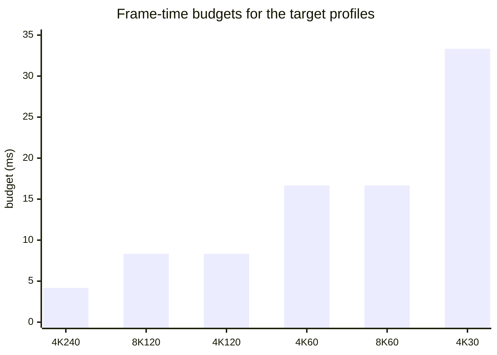
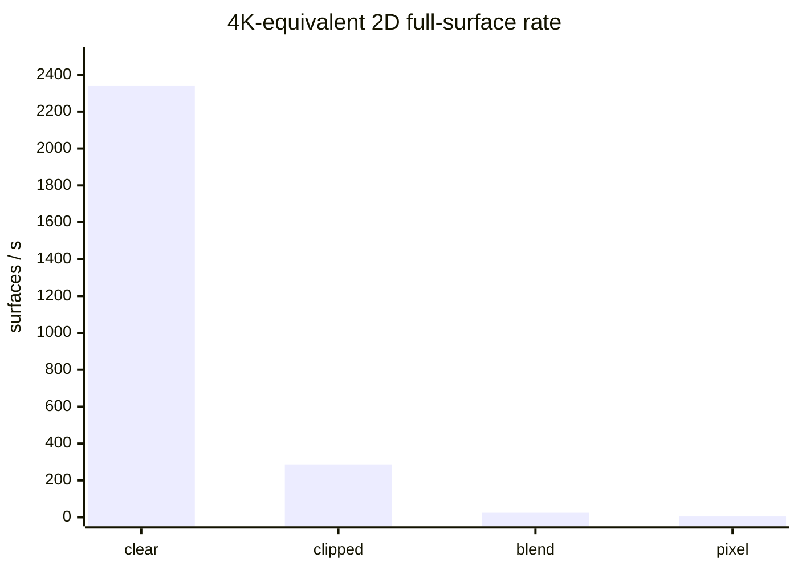

# ZPU ⚡🧊

> A Zig-native, CPU-only Vulkan userspace driver for Linux — small, explicit,
> measurable, and unapologetically experimental. 🐧🦎

ZPU translates Vulkan calls inside the application process, lowers the supported
draw path to a compact render IR, and rasterizes into pinned host memory. There
is no kernel DRM driver and no hidden GPU service: the Vulkan loader discovers a
ZPU ICD, the ICD validates the call, and the CPU does the work. 🧠➡️🖼️

## ✨ At a glance

| Area | State | Evidence / scope |
| --- | --- | --- |
| Vulkan 1.4 core command ABI | ✅ **234/234** | Every cumulative 1.0–1.4 command has a typed entry point, contract, unit/regression evidence, and verification path. See [`docs/vulkan-abi.md`](docs/vulkan-abi.md). |
| Runtime Vulkan feature set | ⚠️ Bounded Vulkan 1.0 | The ICD advertises 1.0 today. Command-level ABI coverage is not a full feature, profile, or CTS-conformance claim. [`docs/api-policy.md`](docs/api-policy.md) is normative. |
| Zig implementation | ✅ Zig 0.16.0 | `extern` ABI records, `?*T` pointers, checked arithmetic, tagged unions, fixed arrays, `@Vector`, `@memcpy`, and explicit format helpers. |
| 2D locality | ✅ One physical core maximum | 2D work remains serialized and pinned to one selected core, even when two cores are allowed. |
| Complex 3D locality | ✅ Two physical cores maximum | The vkcube path uses at most two tile bands/cores; it never fans out to the whole machine. |
| 4K 240 Hz / 8K 60 Hz / 8K 120 Hz | 🧪 Target profiles wired | The p99 frame-time gates and `target-8k-120` build step exist. On this checkout the host vkcube probe currently stops during pipeline creation, so these are not reported as passed measurements. |
| 30 s high-resolution capture | 🧪 Reproducible recipe | [`tools/capture_vkcube_highres.sh`](tools/capture_vkcube_highres.sh) emits VP9 WebM when the selected gate is green. Generated media stays in ignored `scratch_tmp/`; no synthetic or up-scaled clip is presented as proof. |

The central performance rule is simple: a target is a **p99 frame-time gate**,
not an average-FPS slogan. For a target of `H` Hz, the budget is
`1_000_000_000 / H` ns and the 1%-low score is `1e9 / p99_ns`. ⏱️

## 🧭 Linux userspace path



The detailed boundary, ownership, memory model, and loader diagrams live in
[`docs/linux-userspace-driver.md`](docs/linux-userspace-driver.md). ZPU is an
ICD in user space; it is not a kernel display driver and does not claim physical
scan-out timing when a test uses Xvfb. 🪟

## ✅ Vulkan 1.4 ABI coverage

“100% Vulkan 1.4 compliant” is used here in the precise **command/dispatch ABI**
sense: names, calling conventions, LP64 layouts, pointer/count rules, pNext
validation, ownership, lifetime, and failure-atomic behavior. It does **not**
mean that every optional feature is enabled or that the Vulkan CTS passes.

| Core | Required command ABIs | Dispatched | Documented | Unit/regression | Verified |
| --- | ---: | ---: | ---: | ---: | ---: |
| 1.0 | 137 | 137 | 137 | 137 | 137 |
| 1.1 | 28 | 28 | 28 | 28 | 28 |
| 1.2 | 13 | 13 | 13 | 13 | 13 |
| 1.3 | 37 | 37 | 37 | 37 | 37 |
| 1.4 | 19 | 19 | 19 | 19 | 19 |
| **Total** | **234** | **234** | **234** | **234** | **234** |

Commands for capabilities that ZPU does not advertise still have an ABI entry
point and return a truthful default or unsupported result. The generated
per-command matrix is the source of truth: [`docs/vulkan-abi.md`](docs/vulkan-abi.md).

## ⚙️ Zig-native fast path

ZPU keeps the C-facing edge exact and the hot loops idiomatic Zig:

| Zig primitive | Where it helps | Why it matters |
| --- | --- | --- |
| `extern struct`, `?*T`, `?[*]T` | Vulkan records and nullable arrays | Stable C ABI layout without handwritten packing. |
| Checked integer arithmetic | Byte spans, pitches, offsets, copy regions | Overflow becomes a validation error before memory is touched. |
| Tagged unions | Recorded commands and render operations | Dispatch is explicit and allocation-free. |
| Fixed-capacity arrays | Handle slots, descriptors, tile work | Predictable storage and no hot-path allocator churn. |
| `@Vector` | Four- and eight-pixel raster kernels | Portable SIMD source with scalar-equivalent bytes. |
| `@memcpy` + explicit endian/format helpers | Clears, transfers, RGBA/BGRA | Fast copies while keeping representation visible. |

The scalar implementation is the reference. Every selected vector backend is
compared byte-for-byte, including tails, padded strides, clipping, and alpha
edge cases. 🧪

| CPU tier | Dispatch policy | Status |
| --- | --- | --- |
| Baseline/scalar | Safe on every supported x86-64 host | Always enabled |
| Portable vector | Four-pixel `@Vector` kernels in the baseline artifact | Always enabled |
| AVX / AVX2 | CPUID + OSXSAVE + XCR0 checks, then linked x86-64-v3 eight-lane kernels | Runtime-selected when available |
| AVX-512 | Never dispatched; disassembly gates reject accidental leakage | Reserved for measured future work |



## 🎮 Target profiles and frame pacing

These are the real-present gates wired into `build.zig`. A green result requires
the measured p99 frame time to be at or below the target budget. The current
checkout's vkcube probe is blocked during pipeline creation after its
`VK_GOOGLE_display_timing` usage is diagnosed; therefore no row below is being
represented as a passed high-resolution measurement.

| Profile | Surface | Budget | CPU cap | Gate |
| --- | ---: | ---: | ---: | --- |
| 4K30 | 3840×2160 | 33.333 ms | 2 cores | `tools/limited-cpus.sh zig build target-4k-30 -Doptimize=ReleaseFast` |
| 4K60 | 3840×2160 | 16.667 ms | 2 cores | `tools/limited-cpus.sh zig build target-4k-60 -Doptimize=ReleaseFast` |
| 4K120 | 3840×2160 | 8.333 ms | 2 cores | `tools/limited-cpus.sh zig build target-4k-120 -Doptimize=ReleaseFast` |
| **4K240** | **3840×2160** | **4.167 ms** | **2 cores** | `tools/limited-cpus.sh zig build target-4k-240 -Doptimize=ReleaseFast` |
| 8K60 | 7680×4320 | 16.667 ms | 2 cores | `tools/limited-cpus.sh zig build target-8k-60 -Doptimize=ReleaseFast` |
| **8K120** | **7680×4320** | **8.333 ms** | **2 cores** | `tools/limited-cpus.sh zig build target-8k-120 -Doptimize=ReleaseFast` |



Per-process presentation pacing is selected through the sanctioned
`VK_EXT_present_timing` path and `ZPU_REFRESH_HZ`; it is lifecycle-scoped to the
process and can be changed by that process. ZPU emits an actionable error when a
client tries to use `VK_GOOGLE_display_timing`: switch to
`VK_EXT_present_timing`. No compatibility path silently accepts the old control.

## 📊 2D throughput on a 4K surface

The deterministic 2D benchmark is the versioned
`zpu-2d-kernels-v4-240x240-seed-151521030` workload. It measures a 240×240
kernel and reports the **4K-equivalent full-surface rate** below by dividing
the measured MPix/s by 8.2944 MPix (3840×2160). This normalization makes the
surface cost legible; it is not an end-to-end claim that the current vkcube 4K
gate has passed. Rates are from one-core (`CPU 1`) and two-core (`CPU 1,17`)
ReleaseFast runs on an AMD EPYC 9V33. 🧮

| Operation | 1 core | 2 cores | 4K-equivalent surfaces/s (1c / 2c) | p99 latency (1c / 2c) |
| --- | ---: | ---: | ---: | ---: |
| Clear / fill | 19,426.64 MPix/s | 19,466.04 MPix/s | 2,342.14 / 2,346.89 | 2,997 / 3,003 ns |
| Pixel pushes (512 writes) | 36.32 MPix/s | 36.26 MPix/s | 4.38 / 4.37 | 14,210 / 14,493 ns |
| Clipped rectangles | 2,380.58 MPix/s | 2,377.76 MPix/s | 287.01 / 286.67 | 5,119 / 5,118 ns |
| Source-over blend | 203.30 MPix/s | 203.38 MPix/s | 24.51 / 24.52 | 284,801 / 284,626 ns |
| Sprite pushes (128 × 8×8) | 2.7126M draws/s | 2.7113M draws/s | 20.93 / 20.93 (173.61 / 173.52 MPix/s) | 48,249 / 47,592 ns |
| Complete 240×240 frame model | 11,111.85 FPS | 11,071.01 FPS | model-specific, not full-surface | 91,040 / 91,491 ns |

The nearly identical one- and two-core columns are intentional: 2D never spreads
across the second core, preserving cache and NUMA locality. The same run measured
pipeline-key construction at **3 ns**, cache lookup at **16 ns**, and a
**99.999%** hit rate (100,000 hits, one cold miss). Full methodology, checksums,
sampling, and controlled-baseline rules are in
[`docs/benchmarking.md`](docs/benchmarking.md).



## 📐 3D throughput on two cores

This is the frozen, vkcube-specific CPU cube benchmark — twelve triangles at
800×600, five warmups followed by thirty timed frames. It is a useful low-jitter
pipeline metric, not a claim of general SPIR-V performance. The exact run used
`tools/limited-cpus.sh`, CPUs `1,17`, source commit `2518ccf`, and checksum
`37d978fe1c101415`.

| Metric | Result |
| --- | ---: |
| Median frame rate | **261.16 FPS** |
| Frame time p50 / p95 / p99 | 3.826 / 3.840 / **3.873 ms** |
| Triangles submitted / rasterized | 12 / 12 per frame |
| Triangle throughput | **3,133.92 triangles/s** |
| Fragments tested | **103.13M/s** |
| Fragments covered | **96.37M/s** |
| Depth tests passed / color writes | **48.19M/s** |
| Frame-time coefficient of variation | 0.25% |


Run it yourself:

```sh
tools/limited-cpus.sh zig build benchmark-3d -Doptimize=ReleaseFast -- \
  --json --source-commit "$(git rev-parse HEAD)" \
  --utc "$(date -u +%Y-%m-%dT%H:%M:%SZ)"
```

## 🎥 30-second 4K/8K capture recipe

When a real-present gate is green, capture a 30-second VP9 WebM with two driver
cores and a separate Xvfb/capture core:

```sh
# 4K @ 240 Hz (≈7,200 frames)
ZPU_CAPTURE_PROFILE=4k240 ZPU_CAPTURE_SECONDS=30 \
  tools/cpu-fanout.sh --worker 0 -- tools/capture_vkcube_highres.sh

# Or 8K @ 120 Hz (≈3,600 frames)
ZPU_CAPTURE_PROFILE=8k120 ZPU_CAPTURE_SECONDS=30 \
  tools/cpu-fanout.sh --worker 0 -- tools/capture_vkcube_highres.sh
```

The script records the profile, source commit, CPU affinity, dimensions, frame
rate, and SHA-256 in adjacent JSON. It uses Xvfb, so the result demonstrates
ZPU's userspace presentation cadence and rendered motion, **not physical
display scan-out**. VP9 WebM is preferred to a 4K/240 GIF because GIF would
discard color precision and produce an unnecessarily large artifact. Generated
video and screenshots are intentionally ignored; attach them to a release or
PR when the gate is green. 📽️

At the time of this README refresh, both high-resolution probes terminate in
`vkcube` pipeline creation after ZPU reports the unsupported
`VK_GOOGLE_display_timing` request. That is recorded as a blocker, not replaced
with a fabricated or scaled video.

## 🧪 Build, test, and inspect

```sh
zig build
tools/limited-cpus.sh zig build test
tools/limited-cpus.sh zig build api-inventory
tools/limited-cpus.sh zig build isa-gate
tools/limited-cpus.sh zig build benchmark -Doptimize=ReleaseFast -- --json
tools/limited-cpus.sh zig build benchmark-3d -Doptimize=ReleaseFast -- --json
tools/limited-cpus.sh zig build vkcube-ready
tools/limited-cpus.sh zig build target-4k-240 -Doptimize=ReleaseFast
tools/limited-cpus.sh zig build target-8k-120 -Doptimize=ReleaseFast
```

The limiter selects at most eight physical-core representatives and exports the
fingerprint used by the gates. See [`docs/benchmarking.md`](docs/benchmarking.md),
[`docs/pr-readiness.md`](docs/pr-readiness.md), and
[`docs/linux-userspace-driver.md`](docs/linux-userspace-driver.md) for the full
evidence contract. The ICD can be isolated in the system loader with:

```sh
VK_DRIVER_FILES="$PWD/zig-out/share/vulkan/icd.d/zpu_icd.x86_64.json" \
  vulkaninfo --summary
```

## 🧱 Scope, boundaries, and roadmap

ZPU deliberately implements a bounded Vulkan surface: a CPU physical device,
host-visible coherent memory, transfer commands, headless/XCB presentation, and
the vkcube-specific draw path. Unsupported features fail closed. There is no
general shader execution, sparse residency, parallel queue scheduler, or claim
of full Vulkan feature/profile conformance yet. The ABI is complete; the feature
implementation is the work still ahead. 🚧

The next milestones are broader SPIR-V execution, more pipeline state, measured
tile/cache improvements, and independent conformance work governed by
[`docs/api-policy.md`](docs/api-policy.md).
