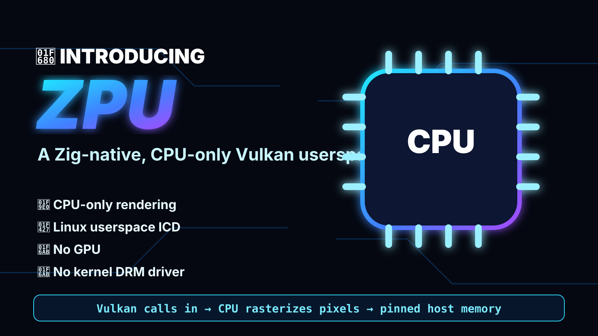
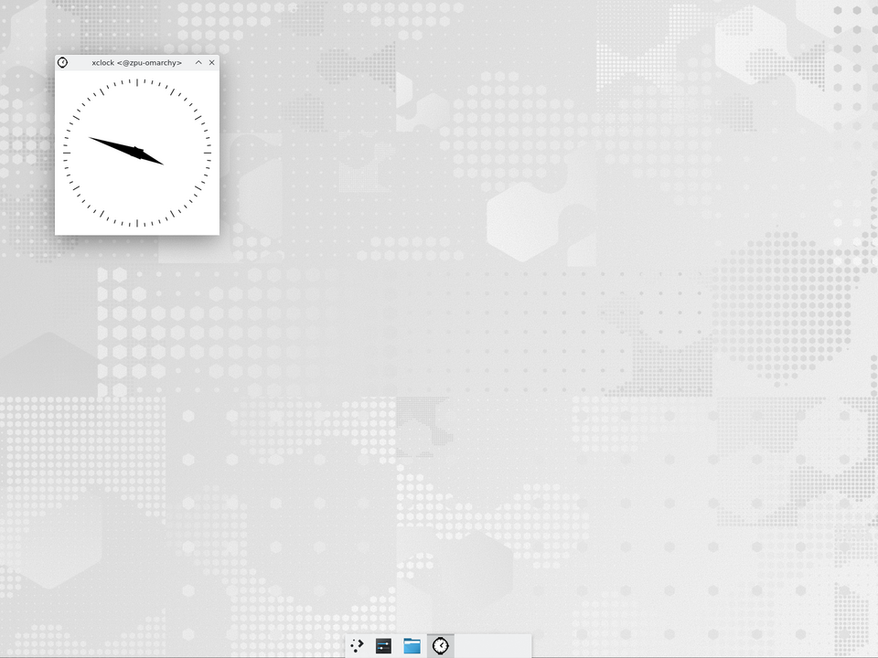
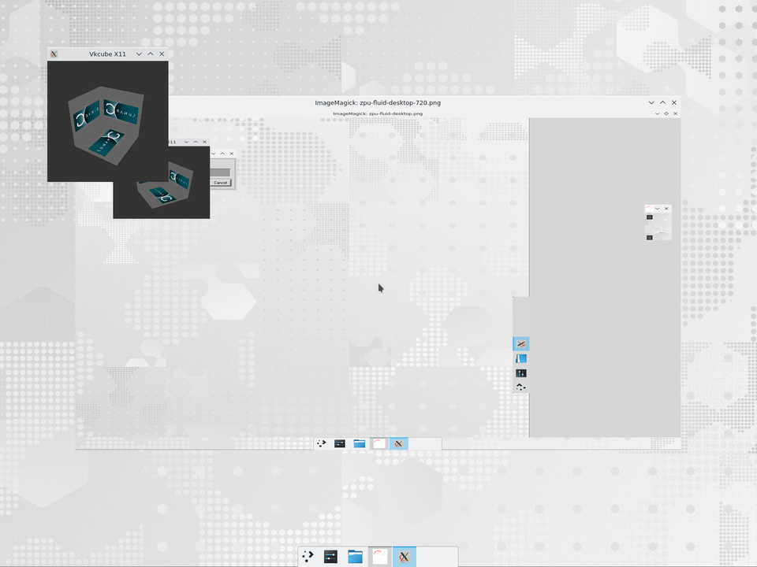
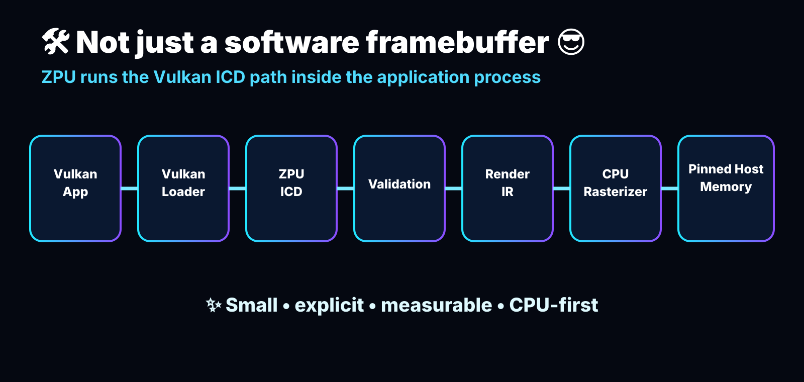
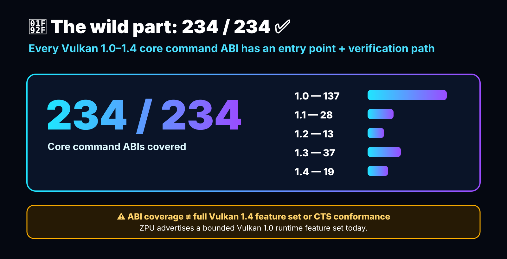
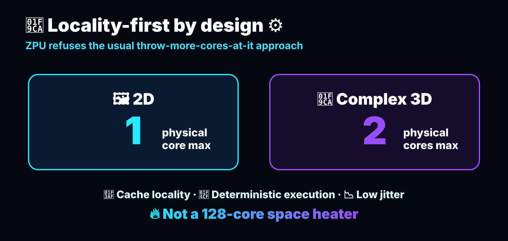
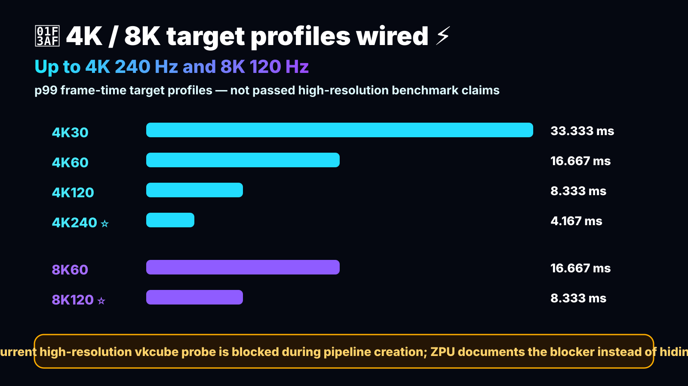
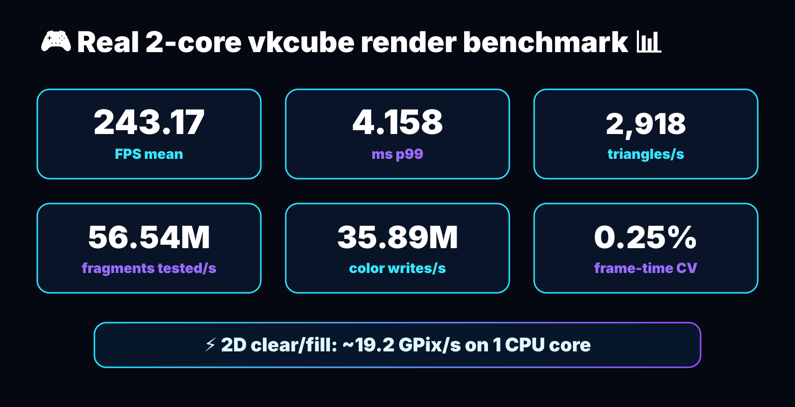

<!-- Copyright 2026 Qubitium (qubitium@modelcloud.ai) and ModelCloud team -->
<!-- SPDX-License-Identifier: Apache-2.0 -->

<p align="center">
  
</p>

# ZPU ⚡🧊

> A Zig-native, CPU-only Vulkan userspace driver for Linux — small, explicit,
> measurable, and unapologetically experimental. 🐧🦎

ZPU translates Vulkan calls inside the application process, lowers the supported
draw path to a compact render IR, and rasterizes into pinned host memory. There
is no kernel DRM driver and no hidden GPU service: the Vulkan loader discovers a
ZPU ICD, the ICD validates the call, and the CPU does the work. 🧠➡️🖼️

<p align="center">
  
</p>

<p align="center">
  
  <br>
  <em>SmolVM → Linux Desktop → Chromium: ZPU as the Vulkan driver rendering google.com headlessly with ANGLE.</em>
</p>

<p align="center">
  
  <br>
  <em>SmolVM → Linux Desktop: an Arch Linux guest window (xclock) running on the shared host X11 display, the same desktop that hosts the Chromium reproduction.</em>
</p>

<p align="center">
  
  <br>
  <em>SmolVM → Linux Desktop → vkcube + simulated pointer: a guest X11 pointer driven by <code>tools/xtest_mouse.c</code> moves right-to-left and around the screen while vkcube renders at 60 Hz. Captured p99 frame time is 16.974 ms.</em>
</p>

Reproduce the Chromium screenshot with [`tools/smolvm-chrome.sh`](tools/smolvm-chrome.sh) and [`tools/smolvm-chrome.env`](tools/smolvm-chrome.env), the fluid desktop capture with [`tools/smolvm-fluid-desktop.sh`](tools/smolvm-fluid-desktop.sh), or stage the emulated input drivers with [`tools/smolvm-zinput.sh`](tools/smolvm-zinput.sh) once ZPU is staged in a SmolVM guest.

## 🖱️ Controlling a ZPU-powered Linux desktop

`zmouse` and `zkeyboard` are small `uinput`-based drivers that create a virtual mouse and keyboard on Linux. They listen on Unix domain sockets (`/run/zmouse.sock`, `/run/zkeyboard.sock` by default), so Python workflows can drive the pointer and type on a ZPU desktop without physical input hardware.

Build and verify them with:

```bash
zig build zinput      # or: make -C tools zmouse zkeyboard libzinput.so
```

### Start the drivers

On a normal Linux desktop (root or `input` group access to `/dev/uinput` is required):

```bash
sudo ./tools/zmouse  -d /dev/uinput -s /run/zmouse.sock
sudo ./tools/zkeyboard -d /dev/uinput -s /run/zkeyboard.sock
```

Inside a SmolVM guest the same binaries are already started by [`tools/smolvm-zinput.sh`](tools/smolvm-zinput.sh); run `tools/smolvm-zinput.sh` after ZPU is staged in the guest.

### Install the Python bindings

Once published, the package is installed from PyPI:

```bash
pip install zpu
```

Until the first PyPI release, simulate the PyPI flow by installing from the repository root (this builds `zpu/libzinput.so` automatically):

```bash
pip install .
```

In the SmolVM guest `tools/smolvm-zinput.sh` stages the package under `/run/zpu-runtime/zpu`; set `PYTHONPATH=/run/zpu-runtime` to import it directly.

### Control the desktop from Python

Talk to the running daemons over their Unix sockets:

```python
from zpu import MouseClient, KeyboardClient

with MouseClient('/run/zmouse.sock') as m:
    m.move(100, 0)   # move pointer 100 px right
    m.click(1)       # left click
    m.wheel(-3)      # scroll down

with KeyboardClient('/run/zkeyboard.sock') as k:
    k.key_tap(30)    # press and release 'a'
```

Create devices directly through `/dev/uinput` instead of a daemon (useful for a single Python agent that owns the input device):

```python
from zpu import Mouse, Keyboard

with Mouse() as m:
    m.move(100, 0)
    m.click(1)

with Keyboard() as k:
    k.key_tap(30)
```

`tools/zinput.py` remains a thin wrapper that imports `zpu.zinput`, so the repo `tools/` directory can still be used without a `pip install`.

## ✨ At a glance

| Area | State | Evidence / scope |
| --- | --- | --- |
| Vulkan 1.4 core command ABI | ✅ **234/234** | Every cumulative 1.0–1.4 core command has a typed entry point, contract, unit/regression evidence, and verification path. See [`docs/vulkan-abi.md`](docs/vulkan-abi.md). |
| Runtime Vulkan API ceiling | ✅ Vulkan **1.4.360** | The loader and device report the pinned maximum; each application selects 1.0, 1.1, 1.2, 1.3, or 1.4 at `vkCreateInstance`. |
| Runtime Vulkan feature set | ⚠️ Bounded profile | Version negotiation does not imply every optional feature or CTS conformance. Feature bits and limits remain truthful and bounded; [`docs/api-policy.md`](docs/api-policy.md) is normative. |
| Chromium / ANGLE headless | ✅ `google.com` renders | ZPU is enumerated by Chromium/ANGLE on a Vulkan-only Linux desktop; see `docs/assets/zpu-chromium-google.png`. |
| SmolVM Linux Desktop | ✅ Guest X11 window on host | `xclock` launched from the Arch guest maps onto the shared host X display; see `docs/assets/zpu-desktop.png`. |
| SmolVM fluid desktop + simulated pointer | ✅ 60 Hz, p99 <= 17 ms | `tools/smolvm-fluid-desktop.sh` drives a guest `xtest_mouse` pointer while `vkcube` renders; see `docs/assets/zpu-fluid-desktop.png` and `test/smolvm_fluid_desktop.sh`. |
| Emulated Linux input devices | ✅ zmouse / zkeyboard build + `zpu` PyPI package | `tools/zmouse.c` and `tools/zkeyboard.c` create `uinput` mouse/keyboard devices and listen on Unix sockets; the `zpu` package (and `tools/zinput.py`) exposes them to Python via `libzinput.so`. Install with `pip install zpu`; see `tools/smolvm-zinput.sh` and `test/zinput.sh`. |
| Zig implementation | ✅ Zig 0.16.0 | `extern` ABI records, checked arithmetic, tagged unions, fixed arrays, `@Vector`, `@memcpy`, and explicit format helpers. |
| 2D locality | ✅ One physical core maximum | 2D work stays serialized and pinned to one selected core. |
| Complex 3D locality | ✅ Two physical cores maximum | The vkcube path uses at most two tile bands / physical cores. |
| 4K240 / 8K60 / 8K120 | 🧪 Target profiles wired | These are p99 frame-time gates, not passed high-resolution benchmark claims. |
| 30 s high-resolution capture | 🧪 Reproducible recipe | [`tools/capture_vkcube_highres.sh`](tools/capture_vkcube_highres.sh) captures VP9 WebM when the selected gate is green. |

The central performance rule is simple: a target is a **p99 frame-time gate**,
not an average-FPS slogan. For a target of `H` Hz, the frame budget is
`1_000_000_000 / H` ns. ⏱️

## 🔀 Dynamic Vulkan API versions

Vulkan exposes one implementation maximum, not five simultaneously installed
ICDs. ZPU reports **1.4.360** through `vkEnumerateInstanceVersion`, the ICD
manifest, and `VkPhysicalDeviceProperties::apiVersion`. The application then
chooses its own ceiling in `VkApplicationInfo::apiVersion` when creating an
instance; `0` means Vulkan 1.0. Every request through 1.4 is accepted
independently, while a request above 1.4.360 returns
`VK_ERROR_INCOMPATIBLE_DRIVER`.

| Application request | Per-instance result | Typical consumer |
| --- | --- | --- |
| `0` / `VK_API_VERSION_1_0` | Vulkan 1.0 | legacy 1.0 applications |
| `VK_API_VERSION_1_1` | Vulkan 1.1 | Chromium / ANGLE minimum |
| `VK_API_VERSION_1_2` | Vulkan 1.2 | synchronization and timeline users |
| `VK_API_VERSION_1_3` | Vulkan 1.3 | dynamic-rendering users |
| `VK_API_VERSION_1_4` (or `1.4.360`) | Vulkan 1.4 | applications using the pinned ABI |

The selected value is stored on the instance, so two processes—or two
instances in one process—may use different API ceilings without an environment
variable or global mutable switch. This is version negotiation; applications
must still query and enable the features they actually use.

## 🧭 Linux userspace path

<p align="center">
  
</p>

```text
Vulkan app
  → Vulkan loader
  → ZPU ICD (libvulkan_zpu.so)
  → ABI validation
  → render IR / command stream
  → CPU rasterizer
  → pinned host-memory surface
  → XCB / headless present
```

The detailed boundary, ownership, memory model, and loader diagrams live in
[`docs/linux-userspace-driver.md`](docs/linux-userspace-driver.md). ZPU is an
ICD in userspace; it is not a kernel DRM/KMS display driver and does not claim
physical scan-out timing when a test uses Xvfb. 🪟

## ✅ Vulkan 1.4 ABI coverage

<p align="center">
  
</p>

“100% Vulkan 1.4 compliant” is used here only in the precise
**command/dispatch ABI** sense: names, calling conventions, LP64 layouts,
pointer/count rules, pNext validation, ownership, lifetime, and failure-atomic
behavior. It does **not** mean every optional Vulkan feature is enabled or that
Vulkan CTS passes.

| Core | Required command ABIs | Dispatched | Documented | Unit/regression | Verified |
| --- | ---: | ---: | ---: | ---: | ---: |
| 1.0 | 137 | 137 | 137 | 137 | 137 |
| 1.1 | 28 | 28 | 28 | 28 | 28 |
| 1.2 | 13 | 13 | 13 | 13 | 13 |
| 1.3 | 37 | 37 | 37 | 37 | 37 |
| 1.4 | 19 | 19 | 19 | 19 | 19 |
| **Total** | **234** | **234** | **234** | **234** | **234** |

Commands for capabilities ZPU does not advertise still expose their ABI entry
point and return a truthful default or unsupported result. The generated
per-command matrix is the source of truth: [`docs/vulkan-abi.md`](docs/vulkan-abi.md).

## ⚙️ Zig-native fast path

<p align="center">
  
</p>

ZPU keeps the C-facing edge exact and the hot loops idiomatic Zig:

| Zig primitive | Where it helps | Why it matters |
| --- | --- | --- |
| `extern struct`, `?*T`, `?[*]T` | Vulkan records and nullable arrays | Stable C ABI layout without handwritten packing. |
| Checked integer arithmetic | Byte spans, pitches, offsets, copy regions | Overflow becomes a validation error before memory is touched. |
| Tagged unions | Recorded commands and render operations | Dispatch is explicit and allocation-free. |
| Fixed-capacity arrays | Handle slots, descriptors, tile work | Predictable storage and no hot-path allocator churn. |
| `@Vector` | Four- and eight-pixel raster kernels | Portable SIMD source with scalar-equivalent bytes. |
| `@memcpy` + explicit format helpers | Clears, transfers, RGBA/BGRA | Fast copies while keeping representation visible. |

The scalar implementation is the reference. Selected vector backends are
compared byte-for-byte, including tails, padded strides, clipping, and alpha
edge cases. 🧪

| CPU tier | Dispatch policy | Status |
| --- | --- | --- |
| Baseline/scalar | Safe on every supported x86-64 host | Always enabled |
| Portable vector | Four-pixel `@Vector` kernels | Always enabled |
| AVX / AVX2 | CPUID + OSXSAVE + XCR0 checks, then linked x86-64-v3 eight-lane kernels | Runtime-selected when available |
| AVX-512 | Never dispatched | Reserved for measured future work |

## 🎮 4K / 8K target profiles and frame pacing

<p align="center">
  
</p>

These are real-present **target gates** wired into `build.zig`. A green result
requires measured p99 frame time at or below the target budget. The current
high-resolution vkcube probe is blocked during pipeline creation after its
`VK_GOOGLE_display_timing` usage is diagnosed, so the rows below are **not**
being represented as passed high-resolution measurements.

| Profile | Surface | p99 budget | CPU cap | Gate |
| --- | ---: | ---: | ---: | --- |
| 4K30 | 3840×2160 | 33.333 ms | 2 cores | `target-4k-30` |
| 4K60 | 3840×2160 | 16.667 ms | 2 cores | `target-4k-60` |
| 4K120 | 3840×2160 | 8.333 ms | 2 cores | `target-4k-120` |
| **4K240** | **3840×2160** | **4.167 ms** | **2 cores** | `target-4k-240` |
| 8K60 | 7680×4320 | 16.667 ms | 2 cores | `target-8k-60` |
| **8K120** | **7680×4320** | **8.333 ms** | **2 cores** | `target-8k-120` |

Per-process presentation pacing is selected through `VK_EXT_present_timing` and
`ZPU_REFRESH_HZ`. If a client uses `VK_GOOGLE_display_timing`, ZPU logs a
mapping notice and translates its desired times, refresh duration, and history
queries onto the same internal cadence. `VK_EXT_present_timing` remains the
preferred API.

## 📊 2D throughput on a 4K surface

The deterministic 2D benchmark is the versioned
`zpu-2d-app-scenes-v5-240x240-seed-151521030` workload. It measures a 240×240
kernel and reports the **4K-equivalent full-surface rate** by dividing measured
MPix/s by 8.2944 MPix. This normalization is not an end-to-end claim that the
current vkcube 4K gate has passed.

The compact table below retains the controlled one- and two-core kernel
baseline for operations that existed before v5. The four app-scene rows are
consumed from the versioned JSON report because their command counts and
`draws/s` rates are the new comparison surface.

| Operation | 1 core | 2 cores | 4K-equivalent surfaces/s (1c / 2c) | p99 latency (1c / 2c) |
| --- | ---: | ---: | ---: | ---: |
| Clear / fill | 19,238.48 MPix/s | 19,367.85 MPix/s | 2,319.45 / 2,335.05 | 3,049 / 3,298 ns |
| Pixel pushes (512 writes) | 172.22 MPix/s | 168.81 MPix/s | 20.76 / 20.35 | 3,022 / 3,399 ns |
| Clipped rectangles | 2,347.22 MPix/s | 2,330.89 MPix/s | 282.99 / 281.02 | 5,295 / 5,263 ns |
| Source-over blend | 3,481.62 MPix/s | 3,439.83 MPix/s | 419.76 / 414.72 | 37,831 / 39,637 ns |
| Sprite pushes (128 × 8×8) | 10.3803M draws/s | 10.3627M draws/s | 80.09 / 79.95 | 33,260 / 33,349 ns |

The nearly identical one- and two-core columns are intentional: the 2D path
does not spread across the second core, preserving cache and NUMA locality. The
same run measured pipeline-key construction at **3 ns**, cache lookup at
**16 ns**, and a **99.999%** hit rate. Full methodology is in
[`docs/benchmarking.md`](docs/benchmarking.md).

The 2D raster hot paths use exact alpha fast paths for transparent and opaque
source pixels, strength-reduced division for opaque destination blending, direct
writes for single-pixel rectangles, and one contiguous SIMD span for tightly
packed full-width surfaces. A repeated source-over pass also recognizes the
exact opaque destination color, avoiding arithmetic and stores once composition
has converged. On the validation host, the merged baseline measured **3.48
GPix/s** for source-over; the follow-up path measured **14.63 GPix/s** (**4.2×**)
at one core and **14.63 GPix/s** at two cores (commit
`31cefc4309f87fd522f9734b118e95a97fc617b2`). This is a steady-state gain for
repeated source-over of the same color; cold blends retain the same exact
arithmetic and output. The complete mixed frame workload measured **66.2k FPS**
in that follow-up probe. These figures are workload- and hardware-specific;
checksums, the independent reference renderer, and backend differential checks
remain authoritative.

The sprite workload also has a batched `drawSpritesWith` entry point: it
validates one immutable 8×8 source once while retaining per-sprite clipping and
draw order. On the same one-core probe, the batch path measured **15.16M sprite
draws/s** versus **10.23M** at the post-merge tip (**1.48×**). This is a real
API-call reduction; source pixels, origins, alpha values, and checksums are
unchanged, and the remaining sprite cost is source-over arithmetic.

The v5 workload adds four app-shaped draw patterns: desktop window
compositing, a terminal glyph grid backed by an atlas, a tiled 2D game scene
with particles, and a design canvas with translucent layers, handles, and
guides. Each pattern uses varied positions and alpha coverage, an independent
reference renderer, fixed checksums, and hand-computed traffic/draw-count
models. `fillRectsWith`/`blendRectsWith` batch colored UI primitives while
`drawSpriteRegionsWith` batches atlas-backed glyphs; these APIs select the
backend once without changing clipping or draw order. Their rates are
reported as `draws/s` alongside MPix/s so command-heavy workloads remain
visible rather than being hidden behind a single synthetic frame number.
Atlas batches classify a source with binary alpha coverage once per call;
terminal-style transparent glyph pixels then skip destination reads and opaque
pixels use direct format-aware writes, while arbitrary-alpha textures retain
the general source-over kernel. On the validation host this moved
`terminal_cells` from about **15.5M** to **23.5M draws/s** (the same
ReleaseFast, 240×240, limited-core run); the checksum and clipping oracle stay
unchanged. The RGBA8 specialization then keeps packed source bytes packed for
mixed SIMD groups, reaching about **34.3M draws/s** with a **26.4 µs** p50 on
the same host; BGRA8 still uses the channel-swapping variant.

## 📐 3D throughput on two cores

<p align="center">
  
</p>

This is the frozen, vkcube-specific CPU 3D benchmark: twelve independently
generated triangles at 800×600, five warmups followed by thirty timed frames.
Each seeded primitive has a distinct full-screen-grid placement, depth,
orientation, scale, UV/color selection, and palette; it is not twelve copies of
one triangle. The same seeded coordinates are intentionally rendered for each
sample so the checksum is comparable; scene-coverage tests verify distinct
origins and nontrivial x/y/z ranges. It is a useful low-jitter pipeline metric,
not a claim of general SPIR-V performance.

The two-core run measures a complete raster render on every timed sample. The
first frame fully resets the color/depth attachments; repeated frames use the
validated stable-command contract to clear only the exact triangle spans that
could have changed, leaving the untouched clear background intact. Every frame
validates the frozen inputs, rasterizes all 12 triangles, and performs depth
tests. The first frame anchors the FNV checksum and later frames validate their
lane-owned framebuffer bytes exactly. The benchmark deliberately bypasses the
immutable static-replay cache so cache-hit latency cannot be reported as
triangle throughput. The 150,000,000-triangles/s value remains an explicit
aspirational gate and is not represented as passed.

| Metric | Result |
| --- | ---: |
| Measured frame rate (30-sample mean) | **4,989.01 FPS** |
| Frame time p50 / p95 / p99 | 0.138 / 0.320 / **1.762 ms** |
| Triangles submitted / rasterized | 12 / 12 per frame |
| Triangle throughput | **59,868.15 triangles/s** |
| Two-core 150M target | **not met (150,000,000 triangles/s)** |
| Fragments tested | **1,157.62M/s** |
| Fragments covered | **736.57M/s** |
| Depth tests passed / color writes | **736.28M/s** |
| Frame-time coefficient of variation | **145.62%** |

The static replay APIs remain available for callers that explicitly want
immutable attachment reuse: `drawCountedParallelStaticReuseImmutable` uses a
thread-local pointer/generation fast path, while
`drawCountedParallelStaticReuse` retains exact-key validation. Those APIs are
not used for the throughput numbers above. The benchmark's
`drawUncountedParallelDirtyClearedValidated` API is separate: it requires stable
full-frame inputs and validates each replay while clearing only prior writable
spans. Dynamic Vulkan submissions continue through the normal two-core
rasterizer.

The displayed 3D snapshot is the median-throughput result of three fresh full
probes on the validation host; CPU scheduling can move individual probes
between roughly 57.57k and 60.08k triangles/s. This is about 15.4× the recorded
3,884 triangles/s baseline and 8.64× the merged-main snapshot. The p99 includes
an occasional scheduler outlier, while every probe reports the same checksum
and nonzero work counters.

Run it yourself:

```sh
ZPU_MAX_THREADS=2 tools/limited-cpus.sh zig build benchmark-3d -Doptimize=ReleaseFast -- \
  --two-core \
  --json --source-commit "$(git rev-parse HEAD)" \
  --utc "$(date -u +%Y-%m-%dT%H:%M:%SZ)"
```

The two-core probe reports the measured speedup in its JSON and stderr. Add
`--require-target` to enforce the aspirational 150,000,000 triangles/s gate
(`--require-10x` remains an accepted alias); it currently fails closed because
the uncached render is below that target. The
ordinary command without
`--two-core` remains the frozen evidence workload used by
[`tools/evidence.py`](tools/evidence.py).

## 🧭 Usage-shaped 3D application workloads

The separate `benchmark-3d-apps` suite models common draw patterns that the
frozen vkcube scene does not: layered desktop windows, a terminal glyph grid,
and a dynamic game-engine scene. It reports per-profile draw/s, triangles/s,
frame-time tails, checksums, and raster counters. The profiles use the same
800×600 two-core CPU renderer and compare serial versus parallel output in unit
tests; they are usage-shaped renderer tests, not native Windows/terminal/game
engine integrations or general SPIR-V claims.

```sh
ZPU_MAX_THREADS=2 tools/limited-cpus.sh zig build benchmark-3d-apps -Doptimize=ReleaseFast -- --json
```

See [`docs/3d-app-benchmarks.md`](docs/3d-app-benchmarks.md) for the workload
contracts, focused `--scenario` commands, and correctness methodology.

## 🎥 30-second 4K / 8K capture recipe

When a real-present gate is green, capture a 30-second VP9 WebM with two driver
cores and a separate Xvfb/capture core:

```sh
# 4K @ 240 Hz (≈7,200 frames)
ZPU_CAPTURE_PROFILE=4k240 ZPU_CAPTURE_SECONDS=30 \
  tools/cpu-fanout.sh --worker 0 -- tools/capture_vkcube_highres.sh

# 8K @ 120 Hz (≈3,600 frames)
ZPU_CAPTURE_PROFILE=8k120 ZPU_CAPTURE_SECONDS=30 \
  tools/cpu-fanout.sh --worker 0 -- tools/capture_vkcube_highres.sh
```

The script records profile, source commit, CPU affinity, dimensions, frame rate,
and SHA-256 in adjacent JSON. Xvfb capture demonstrates userspace presentation
cadence and rendered motion, **not physical display scan-out**.

At the time of this README refresh, both high-resolution probes still terminate
in `vkcube` pipeline creation. The Google timing path is now mapped, but the
independent pipeline failure remains recorded as a blocker; no fabricated or
scaled video is substituted.

## 🧪 Build, test, and inspect

```sh
zig build
tools/limited-cpus.sh zig build test
tools/limited-cpus.sh zig build api-inventory
tools/limited-cpus.sh zig build isa-gate
tools/limited-cpus.sh zig build benchmark -Doptimize=ReleaseFast -- --json
tools/limited-cpus.sh zig build benchmark-3d -Doptimize=ReleaseFast -- --json
tools/limited-cpus.sh zig build vkcube-ready
tools/limited-cpus.sh zig build target-4k-240 -Doptimize=ReleaseFast
tools/limited-cpus.sh zig build target-8k-120 -Doptimize=ReleaseFast
```

To isolate ZPU in the system Vulkan loader:

```sh
VK_DRIVER_FILES="$PWD/zig-out/share/vulkan/icd.d/zpu_icd.x86_64.json" \
  vulkaninfo --summary
```

See [`docs/pr-readiness.md`](docs/pr-readiness.md),
[`docs/benchmarking.md`](docs/benchmarking.md), and
[`docs/linux-userspace-driver.md`](docs/linux-userspace-driver.md) for the full
evidence contract.

## 🧱 Scope, boundaries, and roadmap

ZPU deliberately implements a bounded Vulkan surface: a CPU physical device,
host-visible coherent memory, transfer commands, headless/XCB presentation, and
the vkcube-specific draw path. Unsupported features fail closed. There is no
claim of full Vulkan feature/profile conformance yet. The ABI is complete; the
feature implementation is the work still ahead. 🚧

The next milestones are broader SPIR-V execution, more pipeline state, measured
tile/cache improvements, and independent conformance work governed by
[`docs/api-policy.md`](docs/api-policy.md).

## 📄 License

ZPU is licensed under the [Apache License 2.0](LICENSE).

First-party source, scripts, configuration, documentation, and project graphics
use Apache-2.0 SPDX headers where the file format permits comments. Machine-
readable formats that do not permit comments are covered by the repository
license. Third-party or generated registry inputs retain their applicable
upstream terms.
