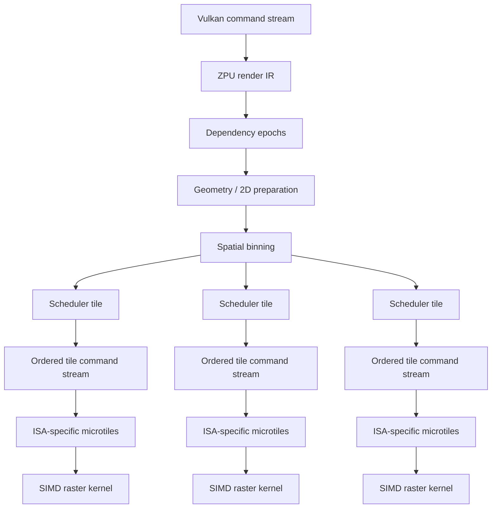
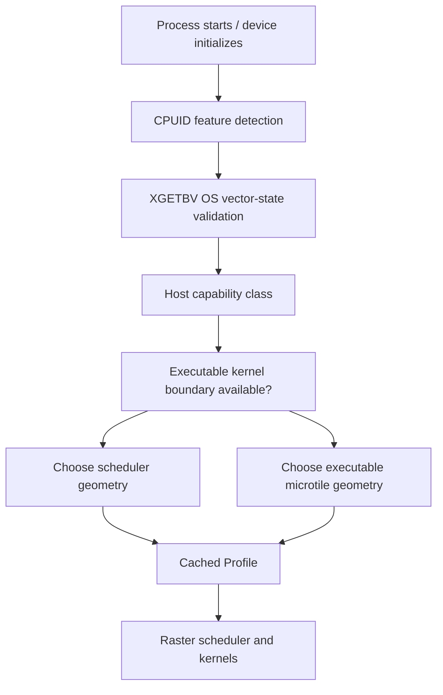
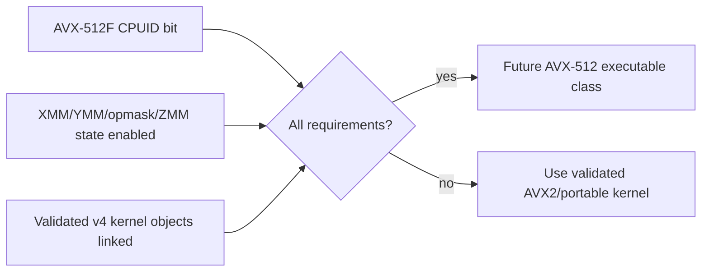
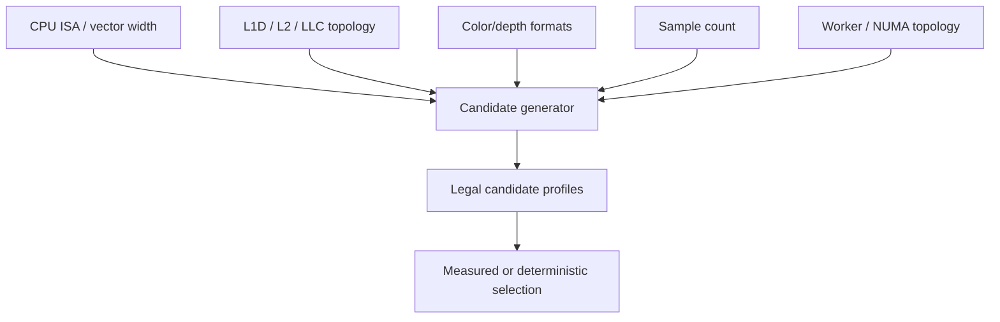
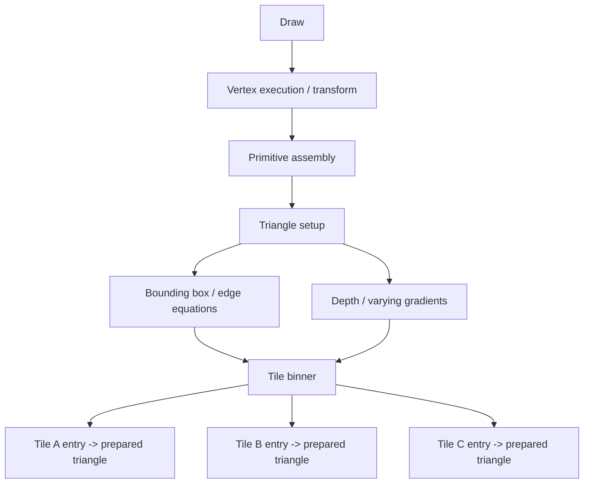
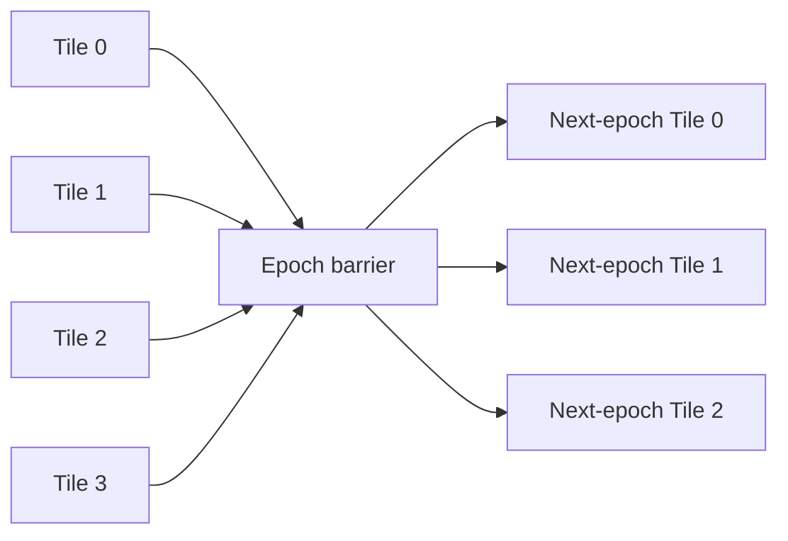
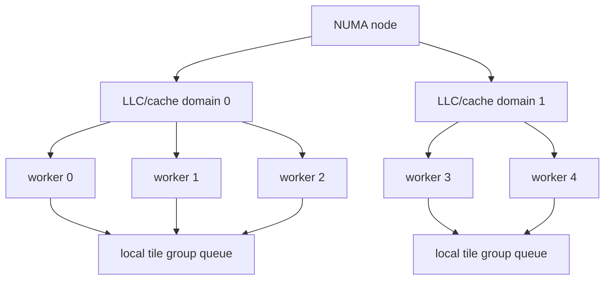
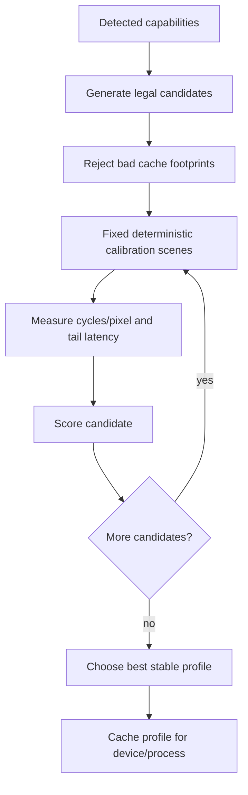

<!-- Copyright 2026 Qubitium (qubitium@modelcloud.ai) and ModelCloud team -->
<!-- SPDX-License-Identifier: Apache-2.0 -->

# Host-tuned tile renderer

## Purpose

ZPU is a CPU renderer, so its execution geometry should be shaped around the CPU that actually runs it rather than around a fixed GPU-like workgroup size. The long-term rendering model is an ordered, tile-binned command stream with two independent levels of spatial granularity:

- **scheduler tiles** divide the framebuffer into independent CPU work units;
- **microtiles** describe the preferred contiguous pixel shape for the active SIMD kernel.

The scheduler tile controls locality, parallel work distribution, and binning overhead. The microtile controls vector utilization and the shape of the innermost raster loop. These are deliberately separate decisions.

This document describes the target architecture and the first implementation step introduced by this branch. It does not claim that the complete tile-command scheduler is implemented yet.

## Current branch boundary

This branch establishes the host profile used by the future scheduler:

- runtime CPU/OS vector-state detection;
- deterministic selection of scheduler-tile and microtile geometry;
- separate **host capability** and **executable ISA** classes;
- initialization through the existing CPU-locality path;
- pure policy tests that can exercise every capability tier on any test host.

The existing x86-64-v3 AVX2 kernel boundary remains unchanged. AVX-512 capability may affect scheduler geometry, but ZPU does not execute AVX-512 instructions until a separately compiled and validated v4 kernel boundary exists.

The existing 32x32 dirty/depth metadata grid also remains unchanged. Metadata granularity and scheduler granularity are separate concepts.

---

## Target execution hierarchy



The intended parallelism hierarchy is:

```text
Frame
  -> scheduler tiles             CPU/core parallelism
      -> ordered tile commands   Vulkan-visible ordering preserved
          -> microtiles          coverage/locality unit
              -> SIMD lanes      AVX2 / future AVX-512 / portable vectors
                  -> pixels
```

A scheduler tile is owned by one raster worker at a time. No two workers write the same tile concurrently. That keeps the hot framebuffer path free of per-pixel locks and minimizes cache-line bouncing.

---

## The tile command stream

Each spatial tile has a vertical, ordered stream of references to render operations that affect it.

```text
                     tile (x=12, y=7)
                           |
                           v
                 +---------------------+
                 | clear background    |
                 | triangle draw 72/17 |
                 | triangle draw 72/18 |
                 | sprite draw 80      |
                 | alpha rectangle 14  |
                 | glyph run 298       |
                 +---------------------+
                           |
                           v
                     raster worker
```

Commands within one tile retain their required order. Different tiles can execute concurrently when their resource dependencies permit it.

The internal stream should be unified across 2D and 3D operations rather than maintaining separate 2D and 3D queues that later need to be merged back into API order.

A representative operation union is:

```zig
const TileOp = union(enum) {
    clear: ClearRef,
    fill: FillRef,
    blit: BlitRef,
    sprite: SpriteRef,
    triangle: TriangleRef,
    resolve: ResolveRef,
};
```

The tile stream contains compact references, not copies of large render commands.

---

## Compact bin storage

Thousands of independent heap-backed queues would add allocator traffic and pointer chasing. Tile membership should instead use contiguous storage similar to a compressed sparse row layout.

```text
TileHeaders
+--------+--------+-------+
| tile   | offset | count |
+--------+--------+-------+
|   0    |      0 |    14 |
|   1    |     14 |     7 |
|   2    |     21 |    22 |
|  ...   |    ... |   ... |
+--------+--------+-------+

TileEntries
+----+----+----+----+----+----+----+--------------------+
| op | op | op | op | op | op | op | ... contiguous ... |
+----+----+----+----+----+----+----+--------------------+
```

A tile entry can remain very small:

```zig
const TileEntry = struct {
    op_index: u32,
    primitive_begin: u32,
    primitive_count: u16,
    flags: u16,
};
```

This layout gives deterministic memory use, sequential reads, easy prefetching, and cheap range assignment to workers.

---

## Scheduler tile versus microtile

The outer tile should not be forced to match SIMD width.

Example AVX2 profile:

```text
32 x 32 scheduler tile

+--------+--------+--------+--------+
|  8x4   |  8x4   |  8x4   |  8x4   |
+--------+--------+--------+--------+
|  8x4   |  8x4   |  8x4   |  8x4   |
+--------+--------+--------+--------+
|  8x4   |  8x4   |  8x4   |  8x4   |
+--------+--------+--------+--------+
|  ... repeated through 32 rows ...  |
+-----------------------------------+

8 contiguous pixels -> one eight-lane vector operation
```

A future 16-lane implementation may prefer a different inner shape without changing the ordering model:

```text
possible future microtile

16 pixels wide x N rows
+-------------------------------+
| p0 ... p15                    |
| p0 ... p15                    |
| ...                           |
+-------------------------------+
```

Square scheduler tiles are not an architectural requirement. Wider SIMD, cache geometry, attachment footprint, and scene behavior can favor rectangular scheduler tiles.

---

## Host profile selection

At initialization ZPU detects what the processor and operating system can safely support, then chooses a profile once. Hot raster loops consume the selected values and should not repeatedly run CPUID/XGETBV policy logic.



The profile deliberately distinguishes these two facts:

```text
host_class        = what the CPU + OS state could support
executable_class  = what ZPU has a validated compiled kernel for
```

That distinction prevents a wide host from making unsupported instructions reachable.

### Initial deterministic profiles

The first policy uses these candidate shapes:

| Host capability | Executable class | Scheduler tile | Microtile | Group | Command batch | Active vector lanes |
| --- | --- | ---: | ---: | ---: | ---: | ---: |
| portable vector | portable vector | 16x16 | 4x2 | 2x2 | 8 | 4 |
| AVX2 | AVX2 | 32x32 | 8x4 | 2x2 | 16 | 8 |
| AVX-512 capable | AVX2 today | 64x16 | 8x4 | 2x4 | 24 | 8 |

These values are **initial policy choices, not final measured optima**. They provide explicit geometry that can be tested now and later replaced by startup autotuning without changing the scheduler ABI.

---

## Why AVX-512 capability does not imply AVX-512 execution

The existing ZPU ISA boundary is intentionally strict. A capability bit is not sufficient to execute an instruction family. The binary must also contain a separately compiled kernel boundary and the OS must have enabled the required extended state.



In the current branch, AVX-512-capable hosts may select a different scheduler shape, but `executable_class` remains AVX2.

---

## Cache-footprint constraint

Scheduler geometry should fit a useful fraction of the core's local cache after accounting for active framebuffer attachments.

A useful first-order model is:

```text
tile_attachment_bytes =
    tile_width * tile_height *
    (color_bytes_per_pixel + depth_bytes_per_pixel + stencil_bytes_per_pixel) *
    samples
```

For RGBA8 + D32 at one sample:

```text
32 * 32 * 4 bytes color = 4 KiB
32 * 32 * 4 bytes depth = 4 KiB
--------------------------------
attachment footprint            = 8 KiB
```

At 4x MSAA the same nominal tile would require roughly 32 KiB of attachment data before shader state, texture lines, command data, stack, and other working state are considered. That is a strong reason to allow tile geometry to vary with render-target configuration rather than binding one size permanently to an ISA.

Future selection should therefore consider both host properties and render-target properties.



---

## 3D path: prepare once, bin prepared primitives

A raw draw command should not be transformed independently in every tile it touches. Vertex work and triangle setup happen once; tile bins reference prepared primitive packets.



A prepared triangle packet can contain the data that every covered tile reuses:

```text
screen-space bounds
edge equations
reciprocal-W data
Z gradients
varying gradients
pipeline/state identifiers
texture identifiers
```

The expensive setup is paid once. Tiles only execute the coverage/shading work relevant to their region.

---

## 2D path

2D operations map naturally to spatial bins. Interior tiles can be marked as full coverage while boundary tiles retain clipping information.

```text
large rectangle

+----+----+----+----+----+
|edge|full|full|full|edge|
+----+----+----+----+----+
|edge|full|full|full|edge|
+----+----+----+----+----+
|edge|full|full|full|edge|
+----+----+----+----+----+
```

Full-coverage tiles can skip repeated geometric clipping. Opaque full-tile overwrites can also enable ordering-safe elimination of earlier framebuffer work when no prior result is semantically observable.

---

## Large and global operations

Naively inserting a full-screen command into every tile can create excessive bin metadata. Operations should eventually be classified by spatial extent:

```text
LOCAL     -> explicit entries in affected tile streams
MACRO     -> region/broadcast entry covering a tile range
GLOBAL    -> epoch/global prefix seen implicitly by all tiles
```

Examples:

| Operation | Likely class |
| --- | --- |
| small triangle | local |
| sprite | local |
| medium blit | local or macro |
| large background layer | macro |
| full-surface clear | global |
| full-screen triangle | macro or global |

A global clear can also be materialized lazily when a tile is first opened instead of eagerly writing untouched tiles.

---

## Ordering and dependency epochs

Tile parallelism must not weaken Vulkan synchronization or visible draw ordering. The scheduler should divide work into dependency epochs.

```text
Epoch 0
  draw A
  draw B
  draw C
       |
       | barrier / dependency boundary
       v
Epoch 1
  draw D
  draw E
       |
       | barrier / dependency boundary
       v
Epoch 2
  draw F
```

Within an epoch, independent tiles can execute concurrently. A required dependency boundary prevents later work from observing incomplete earlier work.



More complex resource interactions can conservatively fall back until dependency analysis is proven correct.

---

## Locality groups and traversal swizzle

Tile execution order should maximize reuse of render state, texture lines, prepared geometry, and framebuffer cache lines. Neighboring tiles can be grouped into a supertile/locality group.

Example 2x2 groups:

```text
+----+----+  +----+----+
| 00 | 01 |  | 04 | 05 |
+----+----+  +----+----+
| 02 | 03 |  | 06 | 07 |
+----+----+  +----+----+

+----+----+  +----+----+
| 08 | 09 |  | 12 | 13 |
+----+----+  +----+----+
| 10 | 11 |  | 14 | 15 |
+----+----+  +----+----+
```

A Morton/Z-order-like traversal is another candidate because it preserves spatial locality over multiple scales:

```text
 0   1   4   5
 2   3   6   7
 8   9  12  13
10  11  14  15
```

Workers should prefer local groups first and steal work when imbalance becomes more important than locality.

---

## CPU / LLC / NUMA scheduling

The existing CPU-locality layer already discovers allowed CPUs, prefers one NUMA node, measures CPU capacity, and tries to keep the current two-core renderer in a cache-sharing domain. The tile scheduler can generalize that model.



The desired policy is:

1. keep a tile owned by one worker during execution;
2. prefer work within the worker's cache/NUMA locality domain;
3. steal from neighboring groups when local work is exhausted;
4. avoid centralized synchronization in the pixel hot path.

---

## Command-depth batching

Spatial X/Y geometry is not the only tunable dimension. The vertical tile stream has a command dimension as well.

```text
Tile stream with 143 entries

entries 0..15    -> command batch
entries 16..31   -> command batch
entries 32..47   -> command batch
...
```

The profile's `command_batch` field provides an initial policy for how much ordered command metadata may be prepared/prefetched together. Batching does not reorder commands; it amortizes dispatch and state setup when neighboring operations share compatible state.

The tuning dimensions therefore include:

```text
scheduler width
scheduler height
microtile width
microtile height
locality-group width
locality-group height
command batch depth
worker count
future pipeline depth / prefetch distance
```

---

## Future startup autotuning

The deterministic policy in `tile_profile.zig` is intentionally replaceable. A later phase can benchmark a small legal candidate set during initialization and cache the winner for the process/device.

The autotuner should not blindly select the widest ISA. It should optimize actual frame-time behavior.



Candidate scoring should include at least:

- raster time / cycles per pixel;
- tile scheduling overhead;
- p95/p99 completion latency;
- worker imbalance;
- cache-miss behavior where portable counters are available;
- memory footprint;
- power/frequency side effects for wide-vector execution.

The calibration must be bounded and deterministic so startup cost does not become a user-visible regression.

---

## Profile invariants

Every selected profile must satisfy structural invariants before reaching a hot path:

```text
scheduler_w % micro_w == 0
scheduler_h % micro_h == 0
scheduler area >= microtile area
group_w > 0
group_h > 0
executable ISA <= compiled/validated kernel boundary
required OS vector state is enabled
```

The current tests exercise portable, AVX2, AVX-512-capable, and missing-vector-state inputs without depending on the test machine's actual CPUID result.

---

## Implementation phases

### Phase 1 - host profile foundation (this branch)

- [x] detect AVX/OSXSAVE/YMM/ZMM state and AVX2/AVX-512F capability;
- [x] keep host capability separate from executable kernel class;
- [x] select scheduler/microtile/group/command geometry;
- [x] cache the selected profile during CPU-locality initialization;
- [x] add deterministic policy tests.

### Phase 2 - existing raster-loop integration

- [ ] replace the current width/lane-count-only 8/32 traversal heuristic with profile-driven scheduler W/H;
- [ ] keep 32x32 dirty/depth metadata independent;
- [ ] add profile-vs-scalar byte-for-byte regression tests;
- [ ] benchmark p50/p95/p99 frame-time changes.

### Phase 3 - ordered tile streams

- [ ] lower render IR operations into compact ordered tile-entry arrays;
- [ ] prepare triangles once and bin prepared primitives;
- [ ] add local/macro/global operation classes;
- [ ] execute one-owner-per-tile worker scheduling;
- [ ] implement cache-local tile-group traversal and work stealing.

### Phase 4 - dependency epochs and broader Vulkan path

- [ ] build explicit resource-dependency epochs;
- [ ] preserve blending/depth/stencil/order guarantees across parallel tiles;
- [ ] introduce conservative fallback for unsupported feedback/dependency cases.

### Phase 5 - wider ISA and autotuning

- [ ] add separately compiled x86-64-v4 kernels only after differential correctness and frame-tail evidence;
- [ ] add bounded startup candidate benchmarking;
- [ ] allow render-target format/sample-count to influence tile geometry;
- [ ] persist or memoize stable profiles when safe.

---

## Success criteria

The tile design is successful only if it improves real CPU rendering without trading away determinism or tail latency. Evaluation should therefore emphasize:

```text
correct pixels first
      |
      v
lower p99 frame time
      |
      v
better multicore scaling
      |
      v
better cache efficiency
      |
      v
higher peak throughput
```

Average FPS alone is not sufficient. Every optimization must preserve ZPU's existing scalar/differential correctness posture and be evaluated against frame-time distribution, missed presentation deadlines, worker balance, and memory overhead.
