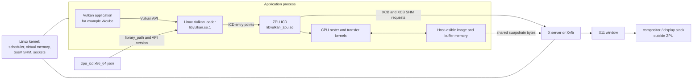
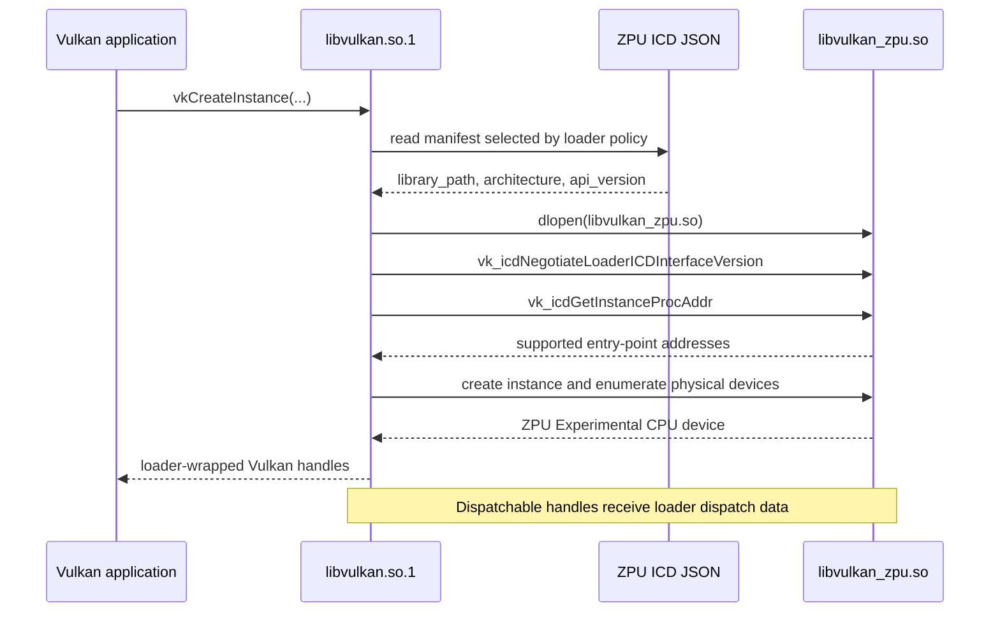
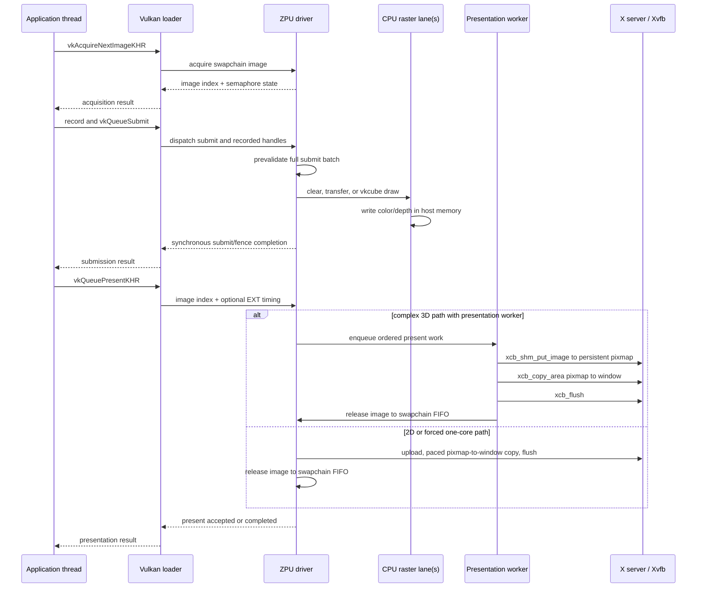
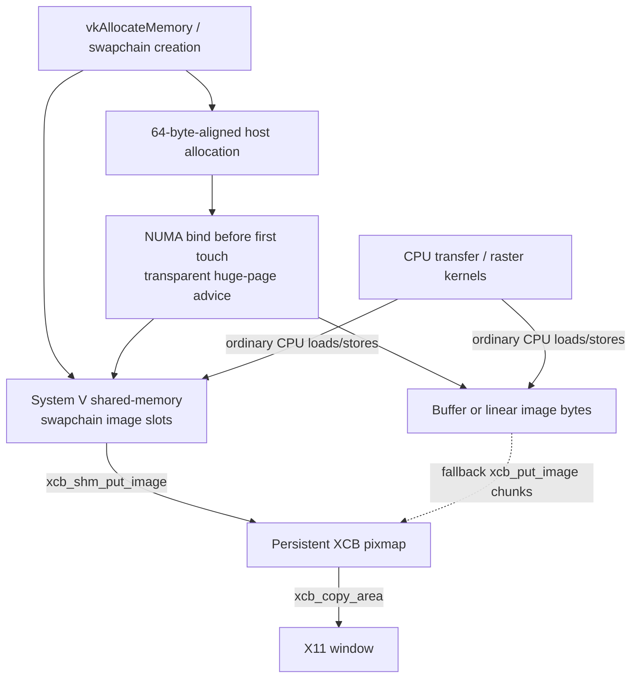
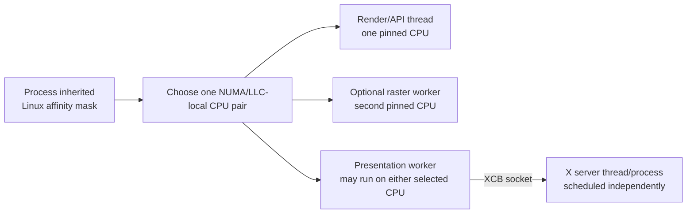

<!-- Copyright 2026 Qubitium (qubitium@modelcloud.ai) and ModelCloud team -->
<!-- SPDX-License-Identifier: Apache-2.0 -->

# ZPU as a Linux userspace Vulkan driver

ZPU is a Vulkan Installable Client Driver (ICD) implemented as a Linux shared
library. It runs inside the Vulkan application's process and renders with CPU
instructions into host memory. The system Vulkan loader discovers ZPU, routes
Vulkan calls into it, and leaves window presentation to ZPU's XCB connection to
the X server.

ZPU is not a kernel module, DRM/KMS driver, Mesa DRI driver, display server, or
window manager. It does not submit commands to a physical GPU. On a physical
X11 desktop, the X server and its existing display stack remain responsible for
putting the resulting X window on a monitor. Under Xvfb, the final display is a
virtual framebuffer in another userspace process.

## Component map



The solid Vulkan path stays in one process until presentation. The application
does not load ZPU directly in normal operation: it calls the loader, and the
loader dispatches each supported call through ZPU's ICD function tables.

## Discovery and dispatch

`zig build` installs these two cooperating artifacts:

| Artifact | Purpose |
| --- | --- |
| `zig-out/share/vulkan/icd.d/zpu_icd.x86_64.json` | Tells the loader which shared library to open, its architecture, and ZPU's advertised Vulkan API version. |
| `zig-out/lib/libvulkan_zpu.so` | Contains the userspace driver, CPU execution paths, Vulkan object model, and XCB WSI backend. |

For a controlled run, `VK_DRIVER_FILES` points the loader at only ZPU's
manifest:

```sh
VK_DRIVER_FILES="$PWD/zig-out/share/vulkan/icd.d/zpu_icd.x86_64.json" \
    vulkaninfo --summary
```

The discovery sequence is:



ZPU currently advertises Vulkan 1.0 and one CPU physical device. Its loader ICD
negotiation accepts the loader's supported version up to interface version 7.
The loader initializes dispatchable objects such as the instance, physical
device, device, queue, and command buffers; ZPU owns their backing storage and
lifetime validation.

The system loader is a runtime boundary, not ZPU's rendering implementation.
On Debian/Ubuntu, `libvulkan1` supplies `libvulkan.so.1`. `libvulkan-dev` adds
the unversioned `libvulkan.so` name needed only when linking repository test
clients with `-lvulkan`. ZPU's ICD itself links the normal C/math runtime and
XCB and does not link back to the Vulkan loader.

## A frame from API call to X11 window



Submission is failure-atomic: ZPU validates the complete submit batch and its
recorded resources/layout transitions before executing any command. The
current queue executes CPU transfer and drawing work synchronously. Presentation
may use the bounded worker after submission, but swapchain ownership remains an
ordered FIFO and an image is not reacquired until its queued presentation work
releases it.

The drawable graphics path is deliberately narrow. The accepted
`cpu_cube_v1` pipeline transforms vkcube vertices, classifies tiles, performs
coverage and depth tests, samples its texture, and writes BGRA/RGBA pixels. The
general SPIR-V profile is metadata-only for public Vulkan drawing and fails
closed at `vkCmdDraw`.

## Memory and presentation path



There is no discrete VRAM heap. ZPU advertises one conservative 256 MiB,
host-visible, host-coherent, non-device-local heap. Buffers and supported linear
images are byte slices in the application's address space. Large internal
allocations are aligned, bound to the selected NUMA node before first touch,
and advised for transparent huge pages.

For XCB swapchains, ZPU first attempts to allocate one page-aligned System V
shared-memory region containing all image slots. It registers that segment with
the X server and exposes each slot to the rasterizer as an aligned byte slice.
This avoids a second application-side framebuffer copy. If XCB SHM is
unavailable, ZPU falls back to bounded `xcb_put_image` chunks. In both cases a
persistent off-screen pixmap is updated first and then copied to the window, so
partial upload strips are never exposed as a frame.

## Threads, CPU locality, and timing



ZPU never expands the affinity mask inherited from the application. Two-
dimensional work stays on one selected CPU. The complex vkcube path may add one
raster worker, for a hard maximum of two ZPU CPUs on the same cache/NUMA
locality. The presentation worker may migrate only between those two selected
CPUs. The X server is a separate process and has its own Linux scheduling and
affinity policy.

Presentation cadence is process-local:

- `ZPU_REFRESH_HZ=1..1000` is read when a swapchain's cadence is initialized on
  its first present. That process-local default then remains fixed in the
  swapchain clock.
- `VK_EXT_present_timing` lets the application choose absolute monotonic or
  relative targets per `vkQueuePresentKHR` call and can change timing throughout
  the process lifetime.
- Its opt-in timing queue also exposes bounded FIFO history through
  `vkGetPastPresentationTimingEXT`, including the queue/dequeue and pixel
  visibility stages requested by the application. `VkPresentId2KHR` IDs are
  retained when supplied, with monotonic per-swapchain IDs as the fallback.
  Count queries and queue-full backpressure do not allocate on the hot path.
- Untimed presents continue on the process's configured cadence.
- `VK_GOOGLE_display_timing` is unsupported and diagnosed with an error that
  directs callers to the sanctioned controls above.

## Linux boundary: what the kernel does and does not do

ZPU calls normal Linux facilities, but Linux does not execute a ZPU-specific GPU
driver:

| Linux facility | How ZPU uses it |
| --- | --- |
| Scheduler and affinity | Pins rendering work and confines optional workers to the selected CPUs. |
| Virtual memory | Backs device memory, images, buffers, caches, and thread stacks. |
| NUMA policy and huge-page advice | Keeps large CPU-rendering allocations local and reduces TLB pressure. |
| pthread synchronization | Implements serialized driver state, raster handoff, and presentation FIFO waits. |
| System V shared memory | Shares swapchain image storage with the X server for XCB SHM uploads. |
| Unix/X11 transport | Carries XCB requests to the X server. |

ZPU does not open a DRM render node, allocate GEM/TTM buffers, emit GPU machine
commands, program a display controller, handle interrupts, or implement KMS.
Those duties belong to a hardware display stack outside ZPU. Consequently:

- `vkcube` under Xvfb tests the Vulkan loader, ZPU CPU rendering, swapchain
  lifecycle, XCB transport, and virtual display output.
- `vkcube` under a physical X server adds that server's existing compositor,
  DRM/KMS, and display hardware after ZPU has handed over the X11 pixels.
- Running a desktop on Xvfb does not mean ZPU renders the desktop; only Vulkan
  applications explicitly selecting the ZPU ICD use it.

## Source ownership map

| Source | Responsibility |
| --- | --- |
| `src/vulkan/zpu_icd.x86_64.json` | Loader discovery metadata. |
| `src/vulkan/driver.zig` | Vulkan ABI, dispatch, objects, validation, command recording/submission, swapchains, and WSI entry points. |
| `src/vulkan/cpu_cube.zig` | vkcube-specific CPU transform, tile classification, rasterization, texture sampling, depth, and dirty-tile clears. |
| `src/vulkan/xcb_present.zig` | XCB resources, shared-memory registration, pixmap upload, window copy, flush, and optional visual verification. |
| `src/vulkan/present_worker.zig` | Bounded ordered presentation queue and timed commit. |
| `src/vulkan/frame_pacing.zig` | Process cadence and precise monotonic deadlines. |
| `src/vulkan/cpu_locality.zig` | CPU selection, affinity, NUMA binding, and huge-page advice. |
| `src/simd/` and `src/raster/` | Generic CPU 2D scalar/vector kernels and dispatch. |

## End-to-end verification

These gates exercise progressively larger portions of the map:

| Gate | Boundary exercised |
| --- | --- |
| `zig build smoke` | Direct ICD loading and loader-interface entry points without the system Vulkan loader. |
| `vulkaninfo --summary` with `VK_DRIVER_FILES` | System-loader discovery and physical-device reporting. |
| `zig build transfer` | C Vulkan client → loader → ZPU command submission → host-memory byte oracle. |
| `zig build headless-present` | Independent C client → loader → `VK_EXT_headless_surface` → no-XCB swapchain acquire/present lifecycle. |
| `zig build vkcube-ready` | Real vkcube acquire/submit/present lifecycle through loader and XCB. |
| `zig build vkcube-visual` | Adds X-server readback proving a rendered pixel reached the window. |
| `zig build target-4k-240` / `target-8k-60` / `target-8k-120` | Adds controlled real-present p99 frame-time gates for the high-resolution profiles. |
| `tools/capture_vkcube_highres.sh` | Captures a provenance-tagged 30-second VP9 WebM at 4K/240 or 8K/120 under Xvfb when the corresponding gate is green. |

Run repository gates through `tools/limited-cpus.sh` so the documented CPU and
topology limits are enforced and fingerprinted.
